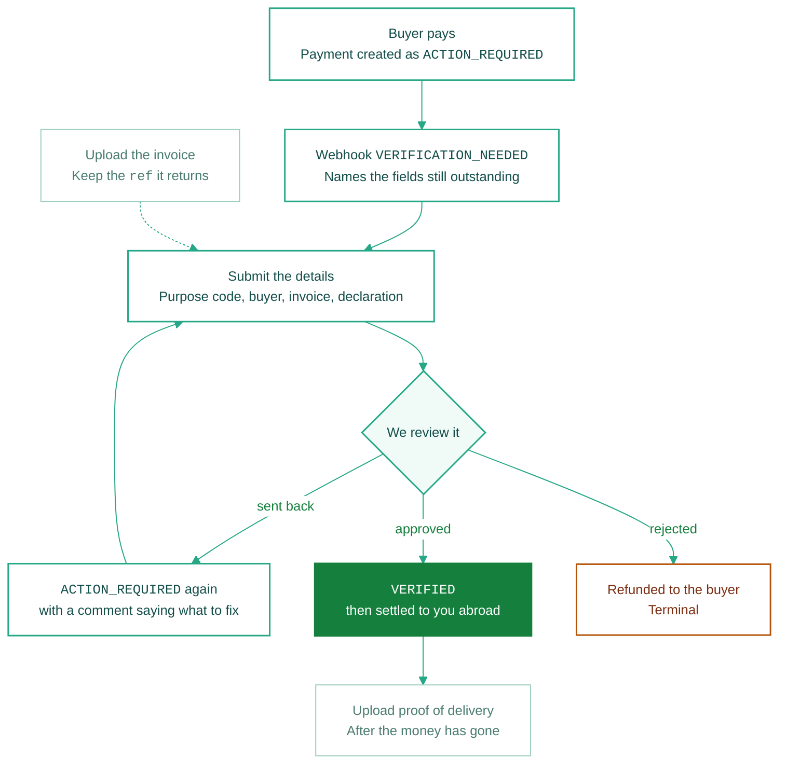

{/* DRAFT — flow, rules and statuses are final. Endpoint paths, field names and
    error codes are placeholders until the B2B services API ships. Every block
    that needs confirming carries a TODO(api) marker. Not yet in docs.json nav:
    publish this together with its API reference so no Card link 404s. */}

Your Indian buyer has paid for a service. We know the amount and the date; we do not know what the service was or who bought it. You tell us, we review it, and the payment settles.

<Info>
  This page covers services only — consulting, software, and everything else in the table below. Physical goods need an HS code and a buyer IEC, which this flow does not collect.
</Info>

<Note>
  **PSPs send `X-Merchant-ID` on every call here**, naming the sub-merchant the payment belongs to. The purpose codes you may declare come from that sub-merchant's account, not yours.
</Note>

## Do it in this order

There is no pre-payment step here. Everything happens after the money lands.



Submit is a single call, not a loop of partial sends. We check the whole set at once and either take it into review or tell you what is wrong with it.

## Declare what the service was

Every services payment settles under one FEMA purpose code, and you pick exactly one. There is no default and no way to leave it blank.

| Code | What it covers |
| :--- | :--- |
| `S0802` | Software consulting and implementation |
| `S0803` | Database and data processing |
| `S1005` | Accounting, auditing and bookkeeping |
| `S1009` | Architectural services |
| `S1010` | Agriculture and forestry services |
| `S1013` | Environmental services |
| `S1015` | Tax consulting |
| `S1016` | Market research and opinion polling |
| `S1017` | Publishing and printing |
| `S1105` | Museum, library and archival services |
| `S1106` | Recreation and sporting activities |

<Warning>
  **You can only send a code your merchant account is enabled for.** That list is set during KYC, from the business categories you declared. A valid code you're not enabled for is rejected just like one that doesn't exist — if the code you need is missing, that's an onboarding conversation, not an API problem.
</Warning>

## Send the details

{/* TODO(api): endpoint paths, header set, multipart field names and the exact
    request envelope below are all placeholders. Confirm against the shipped API
    before publishing. The *contents* — which fields are required, the amount
    rule, the single-invoice rule — are settled and will not change. */}

Two calls. Upload the invoice first and keep the `ref` it returns, then send that ref alongside the fields.

**Uploading the invoice** is `multipart/form-data`:

```bash
curl -X POST 'https://api-pacb-uat.eximpe.com/pg/payments/<payment_id>/documents/' \
  -H 'X-Client-ID: <client_id>' -H 'X-Client-Secret: <client_secret>' \
  -H 'X-Merchant-ID: <sub_merchant_id>' \
  -H 'X-API-Version: 3.0.0' \
  -F 'type=invoice' \
  -F 'file=@invoice-SRV-0198.pdf'
```

**Sending the details** is one JSON call:

```json
{
  "purpose_code": "S0802",
  "buyer_name": "Acme Technologies Pvt Ltd",
  "buyer_address_line_1": "4th Floor, Prestige Tower",
  "buyer_city": "Bengaluru",
  "buyer_state": "Karnataka",
  "buyer_postal_code": "560034",
  "invoice_number": "EXP-2026-SRV-0198",
  "invoice_date": "2026-08-14",
  "invoice_amount": "450000.00",
  "documents": [
    { "code": "invoice", "ref": "a1b2c3d4-5e6f-7a8b-9c0d-1e2f3a4b5c6d" }
  ],
  "declaration": true
}
```

Everything in that body is required. `buyer_address_line_2`, `buyer_email` and `buyer_phone` are accepted and optional — send them if you hold them, because they are what our team uses to reach the buyer if something needs clarifying.

<Card title="Submit Services Verification" icon="code" href="/api-reference/v3/payment/submit-verification-details">
  Full request body, every validation error, and the sandbox test values.
</Card>

## Five things that will bite you

**The invoice amount must equal what actually landed.** Not approximately — we allow one paisa for rounding and nothing more. If the buyer transferred ₹4,49,500 against a ₹4,50,000 invoice, the submission is rejected until the two agree. Raise a revised invoice for what arrived, or have the buyer send the balance and declare against the full amount once it is there.

**There is no HS code here.** HS codes describe physical goods crossing a border. Services have none, and there is no field for one.

**Rejected is terminal, and the money goes straight back.** A rejection is not a stronger send-back. It closes the payment, and we automatically initiate a full refund to the buyer — you cannot resubmit or correct it. Only a **send-back** reopens the payment for editing. Read the decision, not just the fact that something came back.

**Proof of delivery comes after settlement, not before.** It's a separate submission that only opens once the payment reaches `SETTLED`. Uploading it early is not possible, and holding your settlement waiting to attach it is a mistake people make once.

**Editing closes the moment you submit.** While a payment is in review, the fields and the invoice are frozen — no corrections, no swapping the file. If you spot a mistake after submitting, wait for the send-back and fix it then.

## After it settles: proof of delivery

Once the money has reached you, one thing is still owed: evidence that the service was actually delivered. It sits outside the verification flow — nobody reviews it, and it does not gate your settlement — but it is what backs the remittance if the transaction is ever examined.

Upload one or more files under `delivery_proof` — a signed acceptance note, a milestone sign-off, a delivery confirmation email, a timesheet. Send what genuinely evidences delivery.

The set locks when you submit it, so upload everything before you do.

{/* TODO(api): confirm delivery_proof upload + submit endpoints and whether the
    submission is exposed as its own status field on the payment. */}

## Payment statuses

Read `verification_status` on the payment.

| `verification_status` | What it means | What you do |
| :--- | :--- | :--- |
| `ACTION_REQUIRED` | We have the money but not an accepted set of details — either you have not submitted yet, or we sent it back | Read the comment, fix what it names, submit again |
| `IN_REVIEW` | Submitted and with our team. Editing is closed. | Wait |
| `VERIFIED` | Approved. Settlement follows. No webhook fires for this. | Upload proof of delivery once it settles |
| `EXPIRED` | The window closed before we accepted a set of details. Terminal — the money returns to the buyer. | Nothing to recover |

A rejection does not appear in this table. It ends the payment and refunds it, and you learn about it from the refund rather than from a verification status.

{/* TODO(api): confirm how a rejection surfaces to an integrator — whether
    VERIFICATION_NEEDED carries a terminal reason or PAYMENT_REFUNDED is the
    only signal. Internally the review states are DRAFT / UNDER_REVIEW /
    CHANGES_REQUESTED / APPROVED / REJECTED; confirm the external mapping. */}

<Warning>
  **A send-back never discards what you sent.** The buyer details, the invoice fields and the uploaded file are all still there. Change only what the comment asks about and submit the set again.
</Warning>

## Next

<CardGroup cols={2}>
  <Card title="Collection Overview" icon="route" href="/integration-guide/v3/web-integration/collection-overview">
    How a payment moves from the buyer's bank to your account abroad.
  </Card>
  <Card title="Webhooks" icon="bell" href="/integration-guide/v3/web-integration/webhooks">
    Every event, the payload, and how to verify the signature.
  </Card>
</CardGroup>
