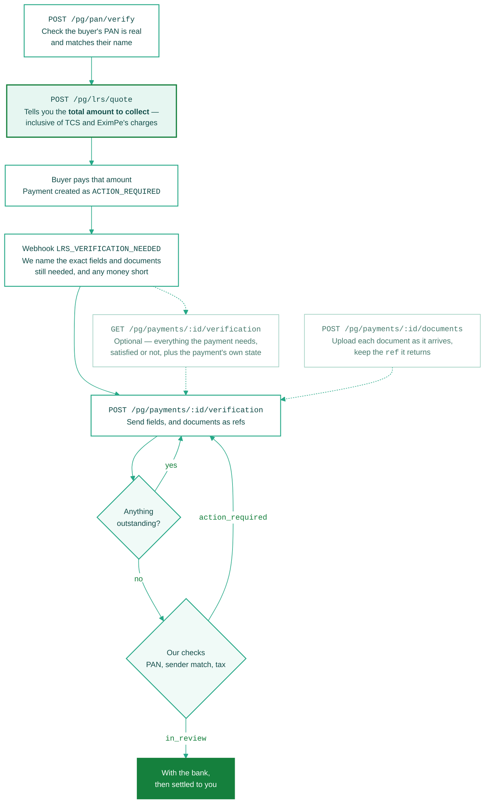

Money has arrived, and the payment is sitting in `ACTION_REQUIRED` — we have the funds but not the paperwork. We tell you exactly what it needs, you send it, and the payment completes itself once nothing is outstanding.

<Info>
  New to the rules? Read [LRS & Compliance](/integration-guide/v3/web-integration/lrs-compliance) first. This page is the API walk-through.
</Info>

<Note>
  **PSPs send `X-Merchant-ID` on every call here**, naming the sub-merchant the payment belongs to. LRS is always scoped to the sub-merchant, never the PSP.
</Note>

## Do it in this order

Every settlement blocker comes from doing one of these out of order. The quote is the important one: it is how you learn **what to ask the buyer for**, and that figure is bigger than the amount you are owed.



The first two calls happen before any money moves. After that it is one call, repeated until nothing is outstanding — partial sends merge, so send each thing as you get it rather than waiting for the full set. The dashed lookup is there when you need it, not on the way through.

### When it does not go straight through

| What happened | What you see | What to do |
| :--- | :--- | :--- |
| The PAN will not verify | `verified: false` with a `reason` — `INVALID_PAN`, `NON_INDIVIDUAL_PAN`, `INOPERATIVE_PAN`, `NAME_MISMATCH` or `DOB_MISMATCH` | Resolve it with the buyer **before** you quote. Nothing downstream works until it passes. |
| The buyer paid too little | `status: "action_required"`, and an `LRS_VERIFICATION_NEEDED` event whose `outstanding` entry names the shortfall in its `message` | Have them transfer the shortfall and link it as a top-up with `linked_payment_id`, or declare a smaller `principal` |
| Something is still missing | `status: "incomplete"`, and `outstanding` on the same response naming every code still owed | Send just those. What you sent before is kept. |
| A complete set failed our checks | `status: "action_required"` with an **empty** `outstanding`, and an `LRS_VERIFICATION_NEEDED` event carrying a sentence per item | Fix what the event names and send again. It usually names `remitter_pan` or `remitter_name`; an entry of `primary_person_name` means the buyer is not the person the money is for, so name that person. |

<Warning>
  **The clock runs from the moment the money lands, not from when you start.** If the verification expiry passes at any point in that loop, the payment is gone — see [The payment has a deadline](#the-payment-has-a-deadline).
</Warning>

## The two calls before the money moves

Steps 1 and 2 are not part of the verification loop, and both are easy to skip.

- **[Verify PAN](/api-reference/v3/lrs/verify-pan)** — do it first. Nothing downstream works until the PAN passes, and you do not want to have chased documents by then.
- **[Quote LRS Amount](/api-reference/v3/lrs/quote)** — this is what tells you **how much to collect**. It returns `total_payable_inr`: the amount to be settled, plus our fee, the GST on that fee, and any tax. Ask the buyer for that figure and the payment covers itself.

## Send what you have

Two calls, and they are independent. Upload each document when you get it and keep the `ref` it returns; then send the fields and those refs together as JSON. Both hang off the payment, so nothing has to be held back until the set is complete.

**Uploading a document** is `multipart/form-data` — a `file` and a `type`:

```bash
curl -X POST 'https://api-pacb-uat.eximpe.com/pg/payments/<payment_id>/documents/' \
  -H 'X-Client-ID: <client_id>' -H 'X-Client-Secret: <client_secret>' \
  -H 'X-Merchant-ID: <sub_merchant_id>' \
  -H 'X-API-Version: 3.0.0' \
  -F 'type=offer_letter' \
  -F 'file=@admission-letter.pdf'
```

**Sending the details** is one JSON call. The envelope never changes — `fields`, `documents`, `finalize` — and what belongs inside is set by the payment's checklist, which its business model and purpose code choose together.

<Tabs>
  <Tab title="Education">
    ```json
    {
      "fields": {
        "remitter_name": "RAVI KUMAR",
        "remitter_pan": "ABCPK1234F",
        "remitter_dob": "1985-04-12",
        "remitter_relation": "PARENT",
        "buyer_declaration": true,
        "principal": "150000.00",
        "collected_tcs": "0.00",
        "primary_person_name": "Ananya Kumar",
        "primary_person_dob": "2005-09-30",
        "primary_person_passport_number": "Z1234567"
      },
      "documents": [
        { "code": "offer_letter", "ref": "a1b2c3d4-5e6f-7a8b-9c0d-1e2f3a4b5c6d" },
        { "code": "passport", "ref": "b2c3d4e5-6f7a-8b9c-0d1e-2f3a4b5c6d7e" },
        { "code": "student_id_or_visa", "ref": "c3d4e5f6-7a8b-9c0d-1e2f-3a4b5c6d7e8f" },
        { "code": "relationship_declaration", "ref": "d4e5f6a7-8b9c-0d1e-2f3a-4b5c6d7e8f90" }
      ]
    }
    ```
  </Tab>

  <Tab title="Travel">
    ```json
    {
      "fields": {
        "remitter_name": "RAVI KUMAR",
        "remitter_pan": "ABCPK1234F",
        "remitter_dob": "1985-04-12",
        "remitter_relation": "SELF",
        "buyer_declaration": true,
        "principal": "150000.00",
        "collected_tcs": "0.00"
      },
      "documents": [
        { "code": "passenger_list", "ref": "a1b2c3d4-5e6f-7a8b-9c0d-1e2f3a4b5c6d" },
        { "code": "traveller_passports", "ref": "b2c3d4e5-6f7a-8b9c-0d1e-2f3a4b5c6d7e" },
        { "code": "traveller_visas", "waiver_reason": "Destination is visa-free" },
        { "code": "ticket", "ref": "c3d4e5f6-7a8b-9c0d-1e2f-3a4b5c6d7e8f" },
        { "code": "invoice", "ref": "d4e5f6a7-8b9c-0d1e-2f3a-4b5c6d7e8f90" }
      ]
    }
    ```
  </Tab>
</Tabs>

<Note>
  Uploading is decoupled from any payment, so you can do it the moment a document arrives rather than holding it until you have the full set. A document can also be waived with a `waiver_reason` instead of a `ref`, where the requirements allow it.
</Note>

<Card title="Submit Verification Details" icon="code" href="/api-reference/v3/lrs/submit-verification-details">
  Complete bodies for every purpose code, both send modes, and every error.
</Card>

## If you need the full picture

The webhook already tells you what is missing, so this call is not part of the loop. Reach for it when you missed the webhook, when you are picking up a payment someone started days ago, or when you are building the screen you show the buyer and want every message up front. It is idempotent — call it whenever.

```bash
curl -X GET 'https://api-pacb-uat.eximpe.com/pg/payments/<payment_id>/verification/' \
  -H 'X-Client-ID: <client_id>' -H 'X-Client-Secret: <client_secret>' \
  -H 'X-Merchant-ID: <sub_merchant_id>' \
  -H 'X-API-Version: 3.0.0'
```

You get the whole requirement set as `fields` and `documents`. Each entry carries a `code`, a `message`, `satisfied` and `provided` — so the ones still owed are those with `satisfied: false`. Those messages are written to be shown to a buyer, including the exact wording they must be shown to affirm `buyer_declaration`.

The response also carries **`settlement_status`**, the payment's own state. Read it before you send: once a payment is `UNDER_REVIEW` or beyond, its verification has been filed and further sends are refused.

<Card title="Get Verification Requirements" icon="code" href="/api-reference/v3/lrs/verification-requirements">
  Full response, statuses, and what each purpose code asks for.
</Card>

## Four things that will bite you

**Partial sends merge.** Three fields today and two tomorrow is five fields. Nothing you sent earlier is wiped. Nobody collects a passport, a visa and an admission letter in the same instant, so do not wait until you have everything.

**An unknown key is a `400`, not a silent drop.** A misspelled `remitter_pan` that we quietly ignored would leave the payment waiting forever for something you believe you sent. Every key is checked before any is written, so one typo cannot half-apply a call.

**Omit a key rather than sending `null` or an empty string.** A boolean is only satisfied by `true` — `false` reads as not yet answered.

**The response tells you what is still owed.** `outstanding` is the list of codes, and `status` is where the payment stands — lower-case, one of four:

| `status` | What it means | What you do |
| :--- | :--- | :--- |
| `incomplete` | Something is still owed. `outstanding` names it. | Send the rest |
| `complete` | Nothing outstanding, nothing filed — you passed `finalize: false`, or this is not an LRS checklist | Nothing, unless you held it back |
| `in_review` | The set was complete, it went through our checks, and it passed. With us now. | Nothing |
| `action_required` | The set was complete and filed, and it did not pass our checks | Read the event, fix what it names, send just that |

`action_required` with an **empty** `outstanding` is the important pair: the checklist is satisfied, our checks refused. That verdict only arrives on the event.

<Warning>
  **`action_required` never means your details were discarded.** Everything you sent is kept. A failed check arrives as an `LRS_VERIFICATION_NEEDED` event with a sentence per item; re-send only what it names.
</Warning>

## The payment has a deadline

A payment that never completes its verification is refunded to the buyer. That is terminal — the window closes and nothing you send afterwards reopens it.

Where the verification gateway names a deadline of its own, it arrives as `payment_verification_expiry` on the event; on the Virtual Bank Account rails that key is `null`, because no gateway set a date. Either way, treat the arrival of the money as when the clock started, surface it in your own UI, and chase against it. It is the difference between a payment that settles and one that unwinds.

## After it passes

Once it clears review the money is settled to you. Track it with the [Settlement APIs](/api-reference/v3/settlement/list) and the [Payment Settled](/api-reference/v3/webhooks/payment-settled) webhook.
