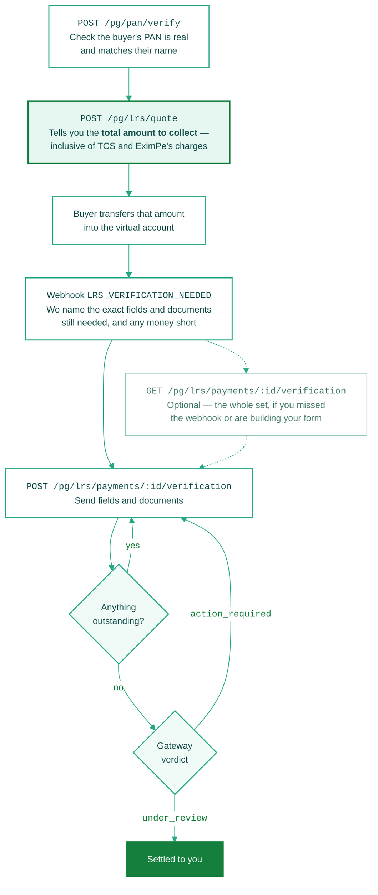

Money has arrived and the payment cannot settle yet. We tell you exactly what it needs, you send it, and the payment completes itself once nothing is outstanding.

<Info>
  New to the rules? Read [LRS & Compliance](/integration-guide/v3/web-integration/lrs-compliance) first. This page is the API walk-through.
</Info>

<Note>
  **PSPs send `X-Merchant-ID` on every call here**, naming the sub-merchant the payment belongs to. LRS is always scoped to the sub-merchant, never the PSP.
</Note>

## Do it in this order

Every settlement blocker comes from doing one of these out of order. The quote is the important one: it is how you learn **what to ask the buyer for**, and that figure is bigger than the amount you are owed.



The first two calls happen before any money moves. After that it is one call, repeated until nothing is outstanding — partial sends merge, so send each thing as you get it rather than waiting for the full set. The dashed lookup is there when you need it, not on the way through.

### When it does not go straight through

| What happened | What you see | What to do |
| :--- | :--- | :--- |
| The PAN will not verify | `verified: false` with a `reason` — `INVALID_PAN`, `NON_INDIVIDUAL_PAN`, `INOPERATIVE_PAN`, `NAME_MISMATCH` or `DOB_MISMATCH` | Resolve it with the buyer **before** you quote. Nothing downstream works until it passes. |
| The buyer paid too little | `action_required`, `missing: ["outstanding"]`, and `outstanding` | Have them transfer the shortfall and link it as a top-up, or declare a smaller `amount_to_be_settled` |
| Something is still missing | `status: "incomplete"`, and the entries in `fields` / `documents` with `satisfied: false` | Send just those. What you sent before is kept. |
| A complete set was refused | `handed_off: true` with `status: "action_required"`, plus `missing` and often a `reason` | Fix what it names and send again. `reason` is usually `PAN_NOT_VERIFIED` or `SENDER_NAME_MISMATCH`; a `missing` entry of `primary_person` means the buyer is not the person the money is for, so name that person. |

<Warning>
  **The clock runs from the moment the money lands, not from when you start.** If the verification expiry passes at any point in that loop, the payment is gone — see [The payment has a deadline](#the-payment-has-a-deadline).
</Warning>

<Note>
  **Do not hardcode the field list.** What a payment needs is decided by its purpose code, and those requirement sets get revised as the regulations behind them do. Drive your form off the response, not off this page.
</Note>

## The two calls before the money moves

Steps 1 and 2 are not part of the verification loop, and both are easy to skip.

- **[Verify PAN](/api-reference/v3/lrs/verify-pan)** — do it first. Nothing downstream works until the PAN passes, and you do not want to have chased documents by then.
- **[Quote LRS Amount](/api-reference/v3/lrs/quote)** — this is what tells you **how much to collect**. It returns `total_payable_inr`: the amount to be settled, plus our fee, the GST on that fee, and any tax. Ask the buyer for that figure and the payment covers itself.

## Send what you have

One endpoint, one envelope: `fields`, `documents`, `finalize`. What belongs inside is set by the purpose code.

**Multipart** sends the files themselves, with no pre-upload. Five documents in one request instead of six:

```bash
curl -X POST 'https://api-pacb-uat.eximpe.com/pg/lrs/payments/<payment_id>/verification/' \
  -H 'X-Client-ID: <client_id>' -H 'X-Client-Secret: <client_secret>' \
  -H 'X-Merchant-ID: <sub_merchant_id>' \
  -H 'X-API-Version: 3.0.0' \
  -F 'fields={"buyer_city":"Bengaluru","remitter_pan":"ABCDE1234F","buyer_declaration":true}' \
  -F 'document.student_passport=@passport.pdf' \
  -F 'document.university_id_card=@student-id.png'
```

**JSON** references documents you uploaded earlier through [Upload Document](/api-reference/v3/lrs/upload-document):

```json
{
  "fields": {
    "remitter_pan": "ABCDE1234F",
    "remitter_relation": "SELF",
    "buyer_declaration": true,
    "amount_to_be_settled": "150000.00"
  },
  "documents": [
    { "code": "student_passport", "ref": "a1b2c3d4-5e6f-7a8b-9c0d-1e2f3a4b5c6d" }
  ]
}
```

<Card title="Submit Verification Details" icon="code" href="/api-reference/v3/lrs/submit-verification-details">
  Complete bodies for every purpose code, both send modes, and every error.
</Card>

## If you need the full picture

The webhook already tells you what is missing, so this call is not part of the loop. Reach for it when you missed the event, you are resuming a half-finished payment, or you are building the form and want every label. It is idempotent — call it whenever.

```bash
curl -X GET 'https://api-pacb-uat.eximpe.com/pg/lrs/payments/<payment_id>/verification/' \
  -H 'X-Client-ID: <client_id>' -H 'X-Client-Secret: <client_secret>' \
  -H 'X-Merchant-ID: <sub_merchant_id>' \
  -H 'X-API-Version: 3.0.0'
```

You get the whole requirement set as `fields` and `documents`. Each entry carries a `code`, a `label`, whether it is `waivable`, and `satisfied` — so the ones still owed are those with `satisfied: false`. Those labels are written to be shown to a buyer, including the exact wording they must be shown to affirm `buyer_declaration`.

The webhook tells you what is **missing**. This tells you **everything**, so use it when you are building the form, resuming a half-finished payment, or you think you missed an event. It is idempotent — call it whenever.

<Card title="Get Verification Requirements" icon="code" href="/api-reference/v3/lrs/verification-requirements">
  Full response, statuses, and what each purpose code asks for.
</Card>

## Four things that will bite you

**Partial sends merge.** Three fields today and two tomorrow is five fields. Nothing you sent earlier is wiped. Nobody collects a passport, a visa and an admission letter in the same instant, so do not wait until you have everything.

**An unknown key is a `400`, not a silent drop.** A misspelled `remitter_pan` that we quietly ignored would leave the payment waiting forever for something you believe you sent. Every key is checked before any is written, so one typo cannot half-apply a call.

**Omit a key rather than sending `null` or an empty string.** A boolean is only satisfied by `true` — `false` reads as not yet answered.

**`handed_off: true` does not mean the payment passed.** It means the gateway reached a verdict. Read `status`:

| `status` | What it means | What you do |
| :--- | :--- | :--- |
| `under_review` | Passed. With the bank now. | Nothing |
| `action_required` | Accepted, but did not pass — PAN, sender match, or the money does not add up | Read `missing` and `reason`, fix, send again |

## The payment has a deadline

Every LRS payment carries a `payment_verification_expiry`. Miss it and verification status becomes `EXPIRED`, which is terminal — the window closes, the money goes back to the buyer, and nothing you send afterwards reopens it.

Surface that date in your own UI and chase against it. It is the difference between a payment that settles and one that unwinds.

## Only education completes today

Travel purpose codes accept details and hold them against the payment, but the verification gateway's rules cover education only, so a travel payment will not advance yet. Education — `S0305` and `S1107` — is unaffected.

## After it passes

Once it clears review the money is settled to you. Track it with the [Settlement APIs](/api-reference/v3/settlement/list) and the [Payment Settled](/api-reference/v3/webhooks/payment-settled) webhook.
